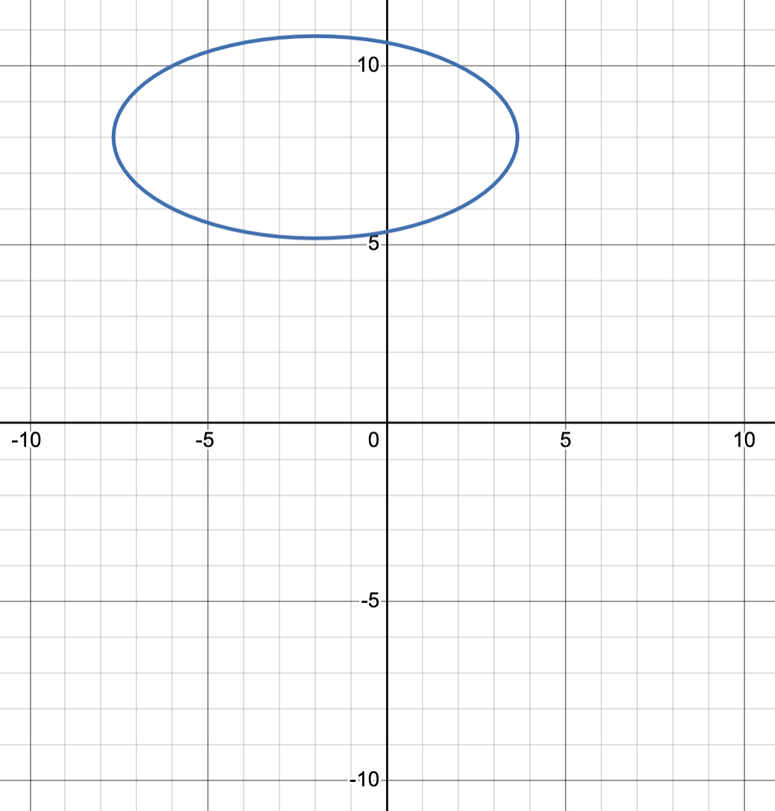
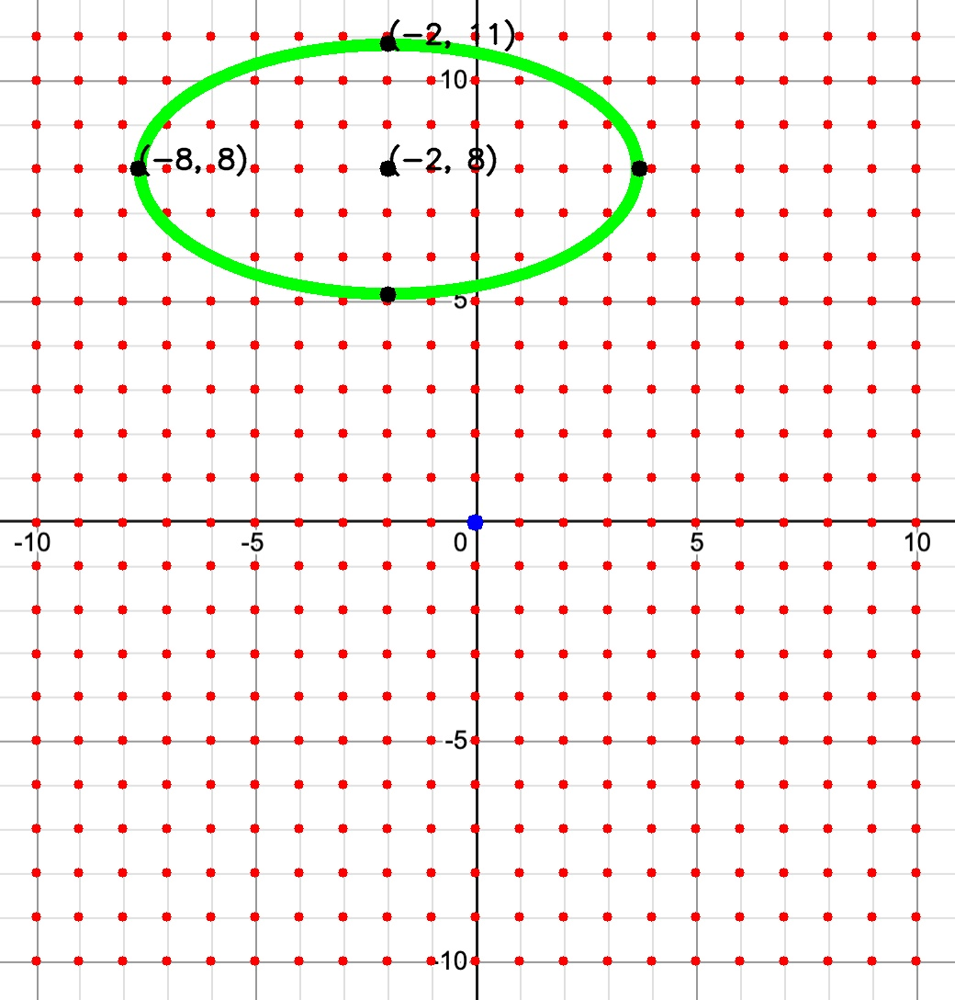
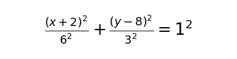

# ICS 483 (Computer Vision) Final Project

This project was part of ICS 483 (Computer Vision) at the University of Hawaiʻi at Mānoa, where students proposed and developed projects that applied the concepts learned in the course to a problem of their interest. A complete overview of the project was documented in a final report.

# Final Report

### [Using Computer Vision to Find the Equation of a Circle/Ellipse](final-report.pdf)
#### Abstract
This project shows the results of detecting a circle or ellipse in a grid graph and finding its equation using computer vision methods. The Hough transform is used as the baseline method for detecting the grid lines and axes in the graph. The same method and color detection are compared to determine the best approach for detecting the circle and ellipse. Finally, the project experiments with training a deep learning model to explore the possibility of expanding the project to detect quadratic curves beyond circles and ellipses, and find their equations.

# Developer Guide

1. Install [Python 3](https://www.python.org/), [OpenCV](https://opencv.org/), [NumPy](https://numpy.org/), and [Matplotlib](https://matplotlib.org/)

2. Navigate to the `uhm-ics483-final-project-main` directory using command line interface

3. Run the program with the following command:
```
python3 main.py input_image/circle_02.jpg
```
The program should output the following images given the input:

#### Input



#### Output




